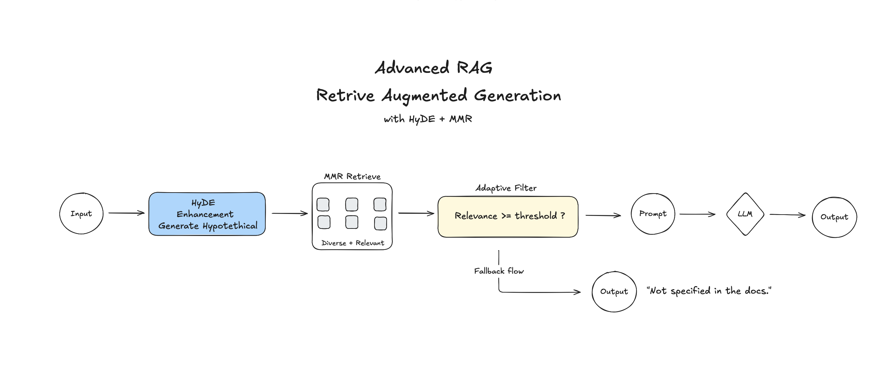

# RAG Tutorial: AcmeTech FAQ API

A full-featured REST API for Q&A on AcmeTech company documentation, built using RAG (Retrieval-Augmented Generation) technology.

## 🎯 What is this

RAG API allows users to ask questions about AcmeTech products and services in natural language and get accurate answers based on official company documentation. The system automatically finds relevant information in the knowledge base and generates comprehensive answers with source attribution.

## ✨ Features

- **HyDE Enhancement**: Hypothetical Document Embeddings for improved query expansion
- **MMR Search**: Maximal Marginal Relevance for diverse and relevant results
- **Adaptive Thresholds**: Dynamic relevance filtering based on query context
- **Smart Fallback**: Low confidence detection with graceful degradation
- **Accurate Answers**: Responses strictly based on documentation, no hallucination
- **Source Attribution**: Every answer includes references to information sources
- **Multilingual**: Accepts questions in different languages, responds in English
- **REST API**: Ready for integration HTTP API
- **CORS Support**: Ready for frontend applications

## 🚀 Quick Start

### Prerequisites

- Python 3.11+
- OpenAI API key
- Docker (optional, for containerized deployment)

### Installation

1. **Clone the repository**
   ```bash
   git clone https://github.com/jhn07/rag-tutorial.git
   cd rag-tutorial
   ```

2. **Create virtual environment**
   ```bash
   python -m venv .venv
   source .venv/bin/activate  # On Windows: .venv\Scripts\activate
   ```

3. **Install dependencies**
   ```bash
   pip install -r requirements.txt
   ```

4. **Configure environment variables**
   ```bash
   cp .env.example .env
   # Edit .env and add your OPENAI_API_KEY
   ```

### Running

#### Option 1: Direct Python execution
```bash
# Start the server
python -m app.main

# Or with uvicorn directly
uvicorn app.main:app --host 0.0.0.0 --port 8000 --reload
```

#### Option 2: Docker (Recommended)
```bash
# Build the Docker image
docker build -t rag-tutorial .

# Run the container
docker run -d -p 8000:8000 --env-file .env --name rag-tutorial-container rag-tutorial

# Stop the container
docker stop rag-tutorial-container

# Remove the container
docker rm rag-tutorial-container
```

Server will be available at: http://localhost:8000

## 📡 API Endpoints

### `GET /`
Health check endpoint

**Response:**
```json
{
  "message": "This is a RAG API for CV"
}
```

### `POST /ask`
Ask a question about AcmeTech documentation

**Request:**
```json
{
  "question": "What programming languages does AcmeTech support?"
}
```

**Response:**
```json
{
  "answer": "AcmeTech supports JavaScript, TypeScript, Python, and Go. Developers can integrate our SDKs into web, backend, and mobile applications.",
  "sources": [
    {
      "text": "AcmeTech supports JavaScript, TypeScript, Python, and Go. Developers can integrate our SDKs into web, backend, and mobile applications.",
      "score": 0.89,
      "metadata": {},
      "low_confidence": false
    }
  ]
}
```

## 🧪 Testing

### Using curl

```bash
# Health check
curl http://localhost:8000/

# Basic question
curl -X POST "http://localhost:8000/ask" \
  -H "Content-Type: application/json" \
  -d '{"question": "What is AcmeTech?"}'

# Negative case - strict answer behavior
curl -s -X POST "http://localhost:8000/ask" \
  -H "Content-Type: application/json" \
  -d '{"question":"Do you offer on-prem pricing details?"}'
# Expected: "Not specified in the docs." with sources: []

```

### Using Python

```python
import requests

response = requests.post(
    "http://localhost:8000/ask",
    json={"question": "Does AcmeTech offer a free plan?"}
)
print(response.json())
```

## 🏗️ Architecture



The system follows the classic RAG (Retrieval-Augmented Generation) pipeline with advanced enhancements:

### Project Structure
```
app/
├── main.py           # FastAPI application and configuration
├── logger.py         # Logging setup
├── models/
│   └── dto.py        # Pydantic models for API
├── handlers/
│   ├── __init__.py
│   └── ask.py        # HTTP request handlers
└── services/
    └── rag.py        # Core RAG system logic with advanced features
```

### Key Components

- **RAGService**: Main service with HyDE, MMR, and adaptive filtering
- **RAGConfig**: Centralized configuration management
- **RAGPrompts**: Organized prompt templates
- **ChromaDB**: Vector database for storing embeddings
- **OpenAI**: Embedding generation (text-embedding-3-small) and LLM (gpt-4o-mini)
- **FastAPI**: HTTP server and API routing

## ⚙️ Configuration

The system supports configuring the following parameters in `RAGService`:

- `relevance_threshold`: Minimum relevance threshold (default 0.35)
- `k`: Number of documents to search (default 4)
- `top_context_docs`: Number of documents for context formation (default 1)
- `use_adaptive_threshold`: Use adaptive threshold (default True)
- `allow_fallback`: Allow fallback to best result (default True)

## 📊 How it Works

### 1. **Indexing** (on first run):
   - Load FAQ from `faq.txt`
   - Split into chunks (600 characters, 120 overlap)
   - Generate embeddings via OpenAI text-embedding-3-small
   - Store in ChromaDB vector database

### 2. **Advanced Query Processing**:
   - **HyDE Expansion**: Generate hypothetical answer to improve retrieval
   - **MMR Search**: Maximal Marginal Relevance for diverse results
   - **Score Normalization**: Normalize relevance scores to [0,1] range
   - **Adaptive Filtering**: Dynamic threshold based on top result confidence
   - **Smart Fallback**: Graceful degradation with low-confidence marking

### 3. **Answer Generation**:
   - Form context from top relevant documents
   - Apply structured prompts via RAGPrompts templates
   - Generate answer using GPT-4o-mini
   - Return response with source attribution and confidence scores

## 🔧 Technologies

- **[FastAPI](https://fastapi.tiangolo.com/)** - Modern web framework
- **[LangChain](https://langchain.com/)** - LLM application framework
- **[ChromaDB](https://www.trychroma.com/)** - Vector database
- **[OpenAI](https://openai.com/)** - Embeddings and language model
- **[Pydantic](https://pydantic.dev/)** - Data validation
- **[Docker](https://www.docker.com/)** - Containerization platform

## 📝 Example Questions

- "What is AcmeTech?"
- "Does AcmeTech offer a free plan?"
- "What programming languages does AcmeTech support?"
- "How does AcmeTech handle authentication?"
- "What databases can I use with AcmeTech?"
- "Does AcmeTech provide AI capabilities?"

## 🐳 Docker Deployment

The application includes production-ready Docker configuration:

### Docker Features
- **Multi-stage build**: Optimized for size and security
- **Non-root user**: Runs as `appuser` for security
- **Health checks**: Built-in container health monitoring
- **Optimized layers**: Dependencies cached separately
- **Security hardening**: Minimal attack surface

### Docker Files
- `Dockerfile`: Production-ready container configuration
- `.dockerignore`: Excludes unnecessary files from build context

### Environment Variables
The container loads environment variables from `.env` file:
```bash
# Required
OPENAI_API_KEY=your_openai_api_key_here
```

### Production Deployment
```bash
# Build for production
docker build -t rag-tutorial:latest .

# Run in production
docker run -d \
  -p 8000:8000 \
  --env-file .env \
  --restart unless-stopped \
  --name rag-tutorial-prod \
  rag-tutorial:latest
```

## 🔐 Security

- Input validation via Pydantic
- Error and exception handling
- Request logging
- No arbitrary code execution
- Docker security: non-root user, minimal base image

## 📈 Monitoring

The system includes detailed logging:
- Incoming requests
- Processing errors
- Service initialization
- Application lifecycle

## 🤝 Development

### Project Structure

The project follows clean architecture principles:
- **Handlers**: HTTP handlers
- **Services**: Business logic
- **Models**: Data models
- **Configuration**: Settings and dependencies

### Extending Functionality

To add new features:
1. Update models in `models/dto.py`
2. Add business logic in `services/`
3. Create new endpoints in `handlers/`
4. Update configuration in `main.py`

## 📄 License

This project is created for educational purposes.